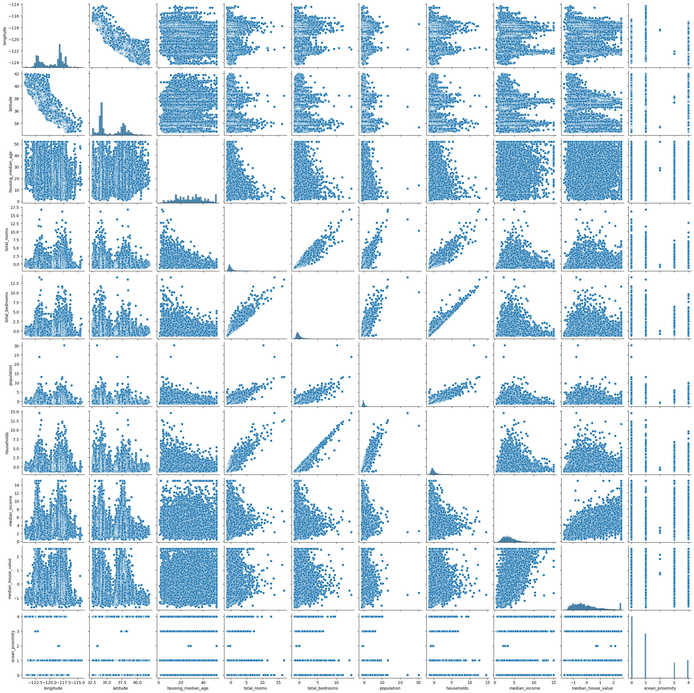
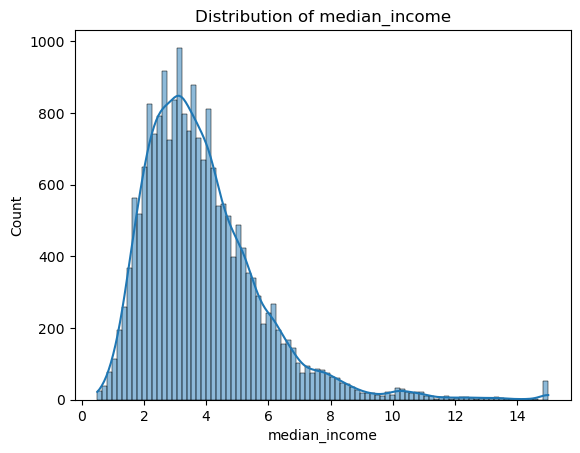
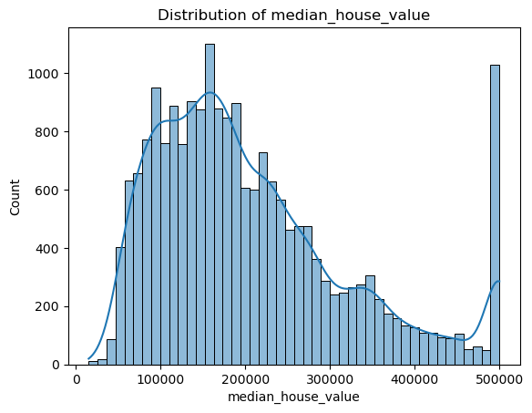

# 🏠 gtc_ml_project3_Housing_Prices

---

## 📌 Project Overview
This is my **third project** during the **Machine Learning Internship at Genius Technology Center (GTC)**.  
The **main goal** of this project was to predict the **median house values in California** using **machine learning regression models**.  

The process began with **data cleaning and EDA**, followed by training multiple models (from linear regression to advanced boosting methods), and finally tuning hyperparameters for the best performance.  

---

## 📊 Dataset Overview
- **Target Variable:** `median_house_value`  
- **Features:** `total_rooms`, `total_bedrooms`, `population`, `households`, `median_income`, `latitude`, `longitude`, and others.  
- **Size:** ~20,000 records  

---

## 🛠️ Methodology & Workflow
1. **Data Cleaning**
   - Handled missing values
   - Removed inconsistencies
2. **Exploratory Data Analysis (EDA)**
   - Distribution of housing values
   - Correlation between features
   - Impact of median income & location on housing price
3. **Feature Scaling & Splitting**
   - Normalization/standardization
   - Train-test split (80%-20%)
4. **Model Training**
   - **Linear Models:** Linear Regression
   - **Tree-based Models:** Decision Tree, Random Forest
   - **Distance-based:** KNN
   - **Boosting Models:** AdaBoost, CatBoost, XGBoost, LightGBM
   - **Support Vector Regressor (SVR)**
5. **Evaluation**
   - Metrics: **R² Score** & **Mean Absolute Error (MAE)**
   - Comparison of train vs. test performance
6. **Hyperparameter Tuning**
   - GridSearchCV for best parameters
   - Best results achieved with **CatBoost**

---

## 🚀 Results 
- **Best Model:** CatBoost Regressor  
- **Best Parameters:** `depth=8`, `iterations=500`, `learning_rate=0.1`  
- **Performance:**  
  - High R² score on test data  
  - Low mean absolute error compared to other models  

📊 Example of comparison table:

| Model              | Train R² | Test R² | MAE   |
|--------------------|----------|---------|-------|
| Linear Regression  | 0.64     | 0.64    | 44k   |
| Decision Tree      | 1.0      | 0.64    | 38k   |
| Random Forest      | 0.98     | 0.82    | 28k   |
| **CatBoost** ✅     | **0.90** | **0.84**| **27k** |

---

## 📊 Visualizations (Sample)

### 1. Distribution of House Values

### 2. Correlation Heatmap

### 3. Median Income vs Median House Value

  
  

---

## 💡 Key Learnings
- Boosting models (CatBoost/XGBoost/LightGBM) significantly outperform simpler models.  
- Proper feature scaling and handling missing values are crucial for regression tasks.  
- Median income proved to be the strongest predictor of house prices.  
- Hyperparameter tuning can drastically improve results compared to default settings.  

---

## 📝 Author
👤 **Abanoub Michel**  
📍 Machine Learning Intern @ GTC  
